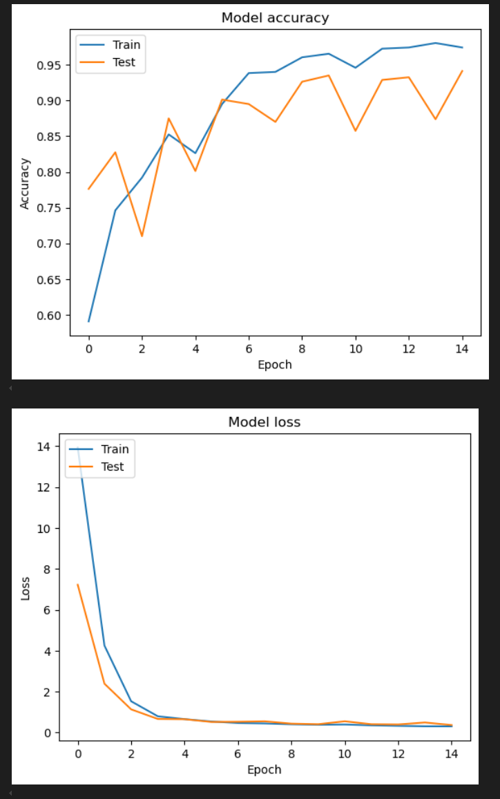
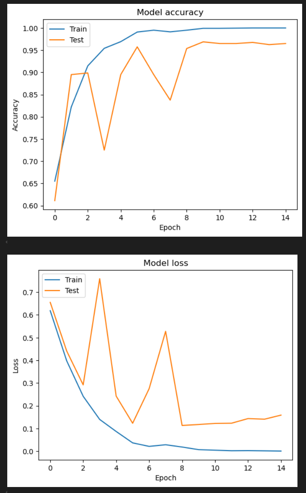

# SpamClassification

A comparative analysis of spam classification

# Quickstart

Install the packages:

`pip install -r requirements.txt`

Or if you're using conda, run

`conda install --yes --file requirements.txt`

# Results

| Model                            | Training accuracy(%) | Testing accuracy(%) |
| -------------------------------- | -------------------- | ------------------- |
| LSTM + GLoVe(100D)               | 99.67                | 94.13               |
| BiLSTM + Attention + GLoVe(100D) | 99.92                | 96.50               |

---

LSTM + GLoVe(100D)

BiLSTM + Attention + GLoVe(100D)

# Error Analysis

#TO-DO

# Reference

[Detection of Fake Reviews on Online Review Platforms using Deep Learning Architectures
](https://github.com/ashishsalunkhe/DeepSpamReview-Detection-of-Fake-Reviews-on-Online-Review-Platforms-using-DeepLearning-Architectures)

Salunkhe, Ashish. "Attention-based Bidirectional LSTM for Deceptive Opinion Spam Classification." arXiv preprint arXiv:2112.14789 (2021).
